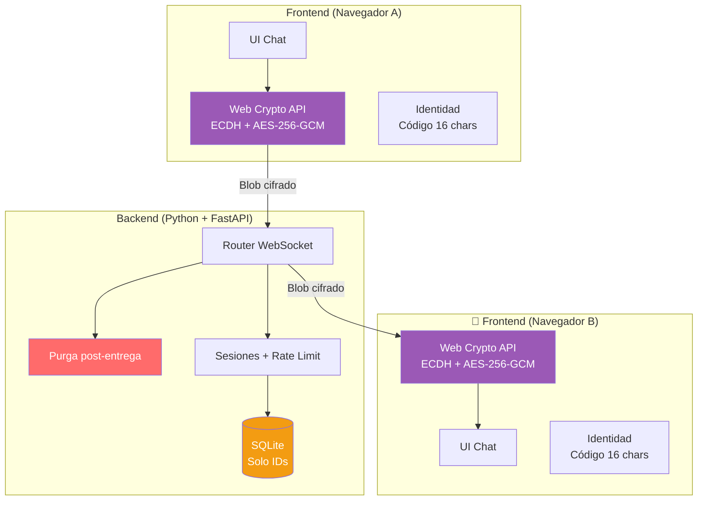
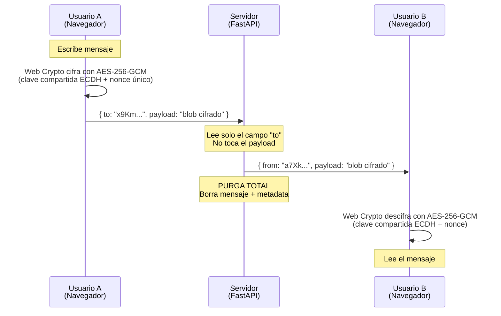
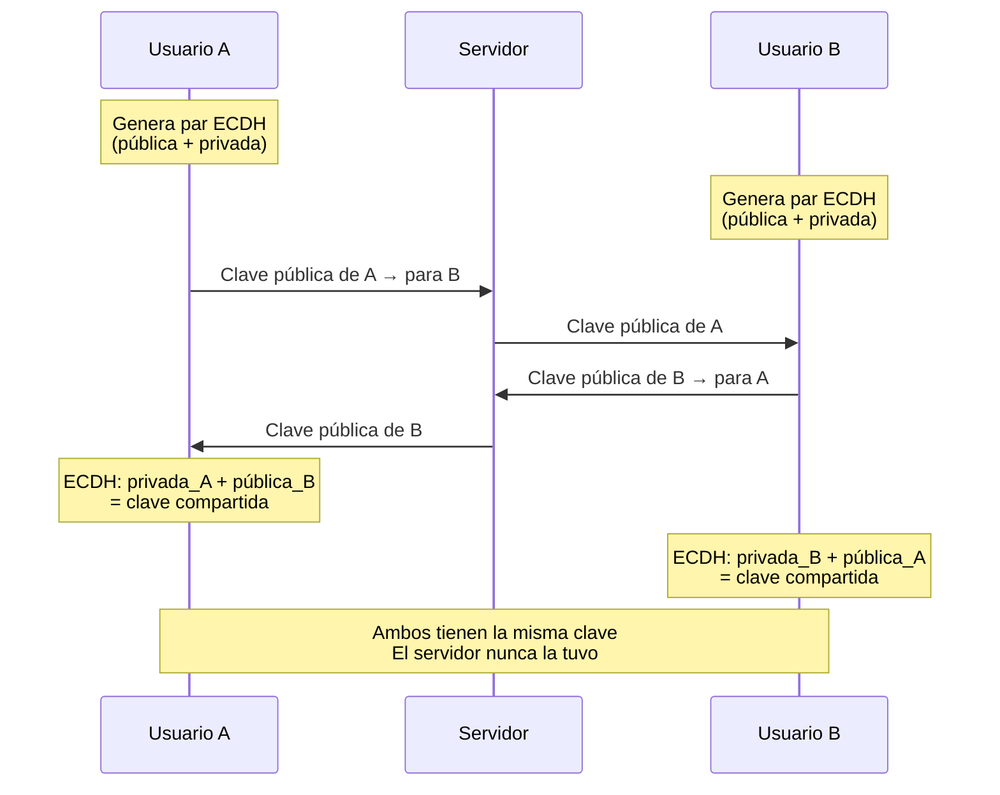
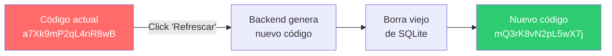

# GhostChat Messenger

**Chat cifrado E2E zero-knowledge.** El servidor es un cartero ciego: enruta mensajes que no puede leer y los purga tras la entrega. Sin nombre, sin email, sin teléfono. Solo un código aleatorio.

---

## Concepto

GhostChat es un sistema de mensajería donde la privacidad no es una promesa, es una limitación técnica. El servidor **no puede** leer tus mensajes porque están cifrados en tu navegador antes de salir. El servidor **no puede** saber quién eres porque tu identidad es un código aleatorio sin datos asociados. Y el servidor **no puede** recordar tus conversaciones porque purga todo tras la entrega.

---

## Stack

| Capa | Tecnología | Responsabilidad |
|------|-----------|-----------------|
| Frontend | HTML + CSS + JS vanilla | UI, cifrado E2E (Web Crypto API), gestión de identidad |
| Backend | Python + FastAPI | Enrutamiento de mensajes, WebSocket, purga, rate limiting |
| Base de datos | SQLite | Solo almacena códigos de identidad (nada más) |

---

## Arquitectura



### Responsabilidades

**Frontend (HTML + CSS + JS)**
- Interfaz de chat responsive (PC + móvil)
- Cifrado/descifrado E2E con Web Crypto API (ECDH para claves, AES-256-GCM para mensajes)
- Gestión del código de identidad (mostrar, copiar, refrescar)
- Empaquetado de mensajes: header en claro (destinatario) + payload cifrado (blob opaco)

**Backend (Python + FastAPI)**
- Gestión de conexiones WebSocket (registro de código ↔ socket en memoria)
- Enrutamiento: lee el campo `to` del header, reenvía el blob al destinatario
- Purga inmediata: tras entregar (o fallar), borra el mensaje de memoria
- Generación de códigos de identidad + almacenamiento en SQLite
- Presencia online/offline
- Rate limiting y validación de formato

**SQLite**
- Una sola tabla con dos columnas. Nada más.

```
┌─────────────────────────────┐
│          users              │
├─────────────────────────────┤
│ id          TEXT (16 chars) │
│ created_at  TIMESTAMP       │
└─────────────────────────────┘
```

---

## Flujo de un mensaje



### Paso a paso

1. **Usuario A escribe** un mensaje en su navegador. El texto existe solo en el DOM.
2. **Web Crypto cifra** el mensaje con AES-256-GCM usando la clave compartida ECDH y un nonce único de 12 bytes.
3. **El frontend empaqueta** el mensaje en un JSON con header en claro (`to`, `type`) y payload opaco (blob cifrado + nonce).
4. **El backend recibe** el paquete por WebSocket. Lee solo `to`, busca el WebSocket del destinatario.
5. **El backend reenvía** el paquete completo sin modificar ni copiar nada.
6. **El backend purga** toda referencia al mensaje de su memoria. No queda rastro.
7. **El frontend de B recibe** el blob cifrado.
8. **Web Crypto descifra** usando la clave compartida y el nonce. El texto aparece en el navegador de B.

---

## Handshake criptográfico (ECDH)

Antes de chatear, ambos usuarios necesitan establecer una clave compartida.



- Las claves privadas **nunca** salen del navegador.
- El servidor solo reenvía las claves públicas (no puede derivar el secreto sin la privada).
- Las claves son **efímeras**: nuevas en cada sesión → perfect forward secrecy.
- La clave compartida se usa para derivar (HKDF-SHA256) la clave AES-256-GCM.

---

## Sistema de identidad

### Sin datos personales

No hay registro con email, teléfono ni nombre. Al acceder por primera vez:

1. El backend genera un código aleatorio de 16 caracteres alfanuméricos (`a-z, A-Z, 0-9`).
2. Lo verifica contra SQLite para evitar colisiones (62^16 ≈ 4.7 × 10²⁸ combinaciones).
3. Lo devuelve al usuario. Es su única identidad.

### Compartir el código

Para chatear con alguien, necesitas su código. Se comparte por un canal externo: en persona, otro chat, papel, QR. El servidor no facilita descubrimiento de contactos.

### Refrescar el código



- **Botón de pánico:** si sientes que tu código está comprometido, lo refrescas y cortas todo vínculo anterior.
- **Tú decides:** código fijo (cómodo) o refrescable (privado). El equilibrio está en tus manos.

---

## Modelo de privacidad

### Lo que el servidor sabe

| Momento | Información |
|---------|-------------|
| Durante el envío | Código A envía algo a código B (header `to` en claro) |
| Durante el envío | Tamaño aproximado del mensaje (longitud del blob) |
| Siempre | Qué códigos están conectados ahora |

### Lo que el servidor NO sabe (nunca)

| Información | Razón |
|-------------|-------|
| Quién es cada código | No hay datos personales asociados |
| Contenido del mensaje | Cifrado E2E, solo los extremos tienen la clave |
| Historial de conversaciones | Purga post-entrega |
| Quién habló con quién en el pasado | No hay logs |

### Tras la entrega

- El mensaje se purga de memoria inmediatamente.
- No se escribe nada a disco (ni logs, ni cache, ni temp).
- SQLite solo contiene códigos sin contexto.
- **Si alguien toma control del servidor → solo encuentra una lista de strings aleatorios.**

---

## Formato de paquete

```json
{
  "to": "x9Km4pQ7rL2nW8vB",
  "from": "a7Xk9mP2qL4nR8wB",
  "type": "text",
  "payload": "<base64 del blob cifrado>",
  "nonce": "<base64 del IV de 12 bytes>",
  "timestamp": 1700000000000
}
```

El backend lee: `to`, `from`, `type`.
El backend **no toca**: `payload`, `nonce`.

### Tipos de mensaje

| Tipo | Descripción | Payload cifrado |
|------|-------------|:---:|
| `key_exchange` | Clave pública ECDH para handshake | ❌ |
| `text` | Mensaje de texto | ✅ |
| `file_meta` | Metadata de archivo (nombre, tamaño, MIME) | ✅ |
| `file_chunk` | Chunk de archivo binario | ✅ |
| `ping` | Keep-alive | ❌ |
| `disconnect` | Aviso de desconexión | ❌ |

---

## Parámetros criptográficos

| Parámetro | Valor |
|-----------|-------|
| Intercambio de claves | ECDH (P-256) |
| Cifrado simétrico | AES-256-GCM |
| Nonce/IV | 12 bytes (96 bits) |
| Tag de autenticación | 128 bits |
| Derivación de clave | HKDF-SHA256 |
| Forward secrecy | Sí (claves efímeras por sesión) |

---

## Estructura del proyecto

```
ghostchat/
├── backend/
│   ├── main.py              # FastAPI, WebSocket handler, routing
│   ├── models.py            # SQLite (tabla users)
│   ├── identity.py          # Generación y gestión de códigos
│   ├── router.py            # Enrutamiento de mensajes
│   ├── purge.py             # Purga post-entrega
│   ├── rate_limiter.py      # Rate limiting
│   ├── config.py            # Configuración
│   └── requirements.txt     # FastAPI, uvicorn, aiosqlite
├── frontend/
│   ├── index.html           # Página principal
│   ├── css/
│   │   └── style.css        # Responsive
│   ├── js/
│   │   ├── app.js           # Lógica principal
│   │   ├── crypto.js        # Web Crypto API
│   │   ├── websocket.js     # Conexión WebSocket
│   │   ├── identity.js      # Gestión del código
│   │   └── ui.js            # DOM, notificaciones
│   ├── manifest.json        # PWA
│   └── sw.js                # Service Worker
├── README.md
└── LICENSE
```

---

## Roadmap

### Fase 1 — Comunicación básica
Backend WebSocket con FastAPI. Frontend mínimo. Generación de códigos. Mensajes en plano (sin cifrar). Purga básica.

### Fase 2 — Protocolo de mensajes
Estructura JSON (header + payload). Tipos de mensaje. Validación de formato. Manejo de errores.

### Fase 3 — Cifrado E2E
ECDH con Web Crypto API. Handshake de claves. AES-256-GCM por mensaje. El servidor pasa a ser ciego.

### Fase 4 — UI responsive + PWA
Diseño mobile-first. Indicadores de estado. Notificaciones. Service Worker. Instalable en móvil.

### Fase 5 — Transferencia de archivos
Chunking + cifrado. Barra de progreso. Aceptar/rechazar. Límite configurable.

### Fase 6 — Features avanzados
Salas multiusuario. Presencia online/offline. Cola temporal offline. Fingerprint de clave pública.

---

## Seguridad — Superficie de ataque

| Vector | Mitigación |
|--------|------------|
| Servidor comprometido | Solo ve blobs cifrados + códigos sin contexto |
| MITM en handshake | Verificación de fingerprint fuera de banda (Fase 6) |
| Replay attack | Nonce único + timestamp por mensaje |
| Código robado | Refresco inmediato elimina el código viejo |
| Brute force del código | 62^16 ≈ 4.7 × 10²⁸ combinaciones |
| Análisis de tráfico | Purga elimina patrones históricos |
| Acceso físico al dispositivo | Claves solo en memoria del navegador |

---

## Licencia

MIT
