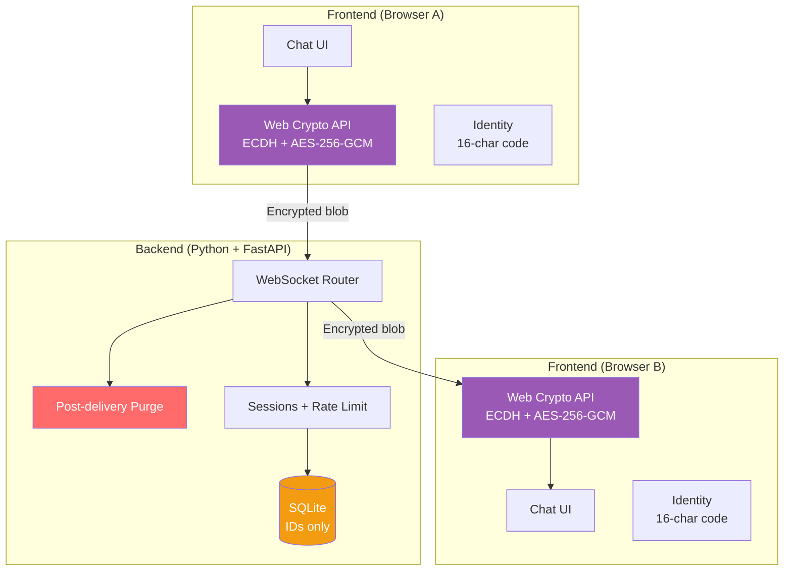
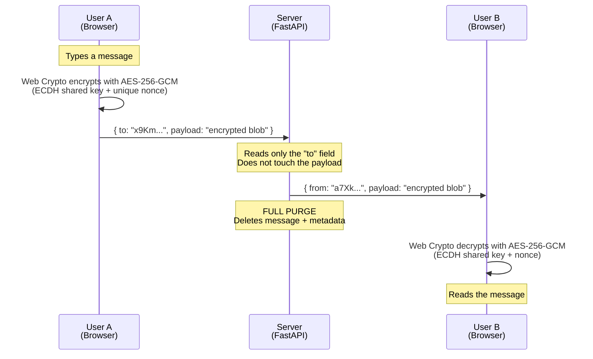
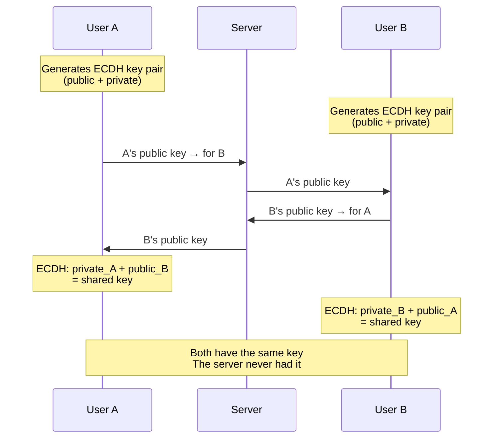
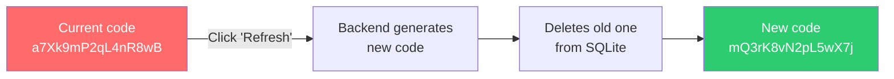

# GhostChat Messenger

**E2E encrypted zero-knowledge chat.** The server is a blind courier: it routes messages it cannot read and purges them after delivery. No name, no email, no phone number. Just a random code.

> This README was written by the project author and improved with the help of [Claude](https://claude.ai).
> Claude helped me rewrite this README and build this project by answering my questions and guiding me.

---

## Concept

GhostChat is a messaging system where privacy is not a promise — it's a technical limitation. The server **cannot** read your messages because they are encrypted in your browser before they leave. The server **cannot** know who you are because your identity is a random code with no associated data. And the server **cannot** remember your conversations because it purges everything after delivery.

---

## Stack

| Layer | Technology | Responsibility |
|-------|-----------|----------------|
| Frontend | HTML + CSS + Vanilla JS | UI, E2E encryption (Web Crypto API), identity management |
| Backend | Python + FastAPI | Message routing, WebSocket, purge, rate limiting |
| Database | SQLite | Stores identity codes only (nothing else) |

---

## Architecture



### Responsibilities

**Frontend (HTML + CSS + JS)**
- Responsive chat interface (desktop + mobile)
- E2E encryption/decryption with Web Crypto API (ECDH for key exchange, AES-256-GCM for messages)
- Identity code management (display, copy, refresh)
- Message packaging: plaintext header (recipient) + encrypted payload (opaque blob)

**Backend (Python + FastAPI)**
- WebSocket connection management (code ↔ socket mapping in memory)
- Routing: reads the `to` field from the header, forwards the blob to the recipient
- Immediate purge: after delivery (or failure), all references to the message are wiped from memory
- Identity code generation + storage in SQLite
- Online/offline presence
- Rate limiting and format validation

**SQLite**
- A single table. Nothing more.

```
┌─────────────────────────────┐
│          users              │
├─────────────────────────────┤
│ id          TEXT (16 chars) │
│ created_at  TIMESTAMP       │
└─────────────────────────────┘
```

---

## Message flow



### Step by step

1. **User A types** a message in the browser. The text exists only in the DOM.
2. **Web Crypto encrypts** the message with AES-256-GCM using the ECDH shared key and a unique 12-byte nonce.
3. **The frontend packages** the message into a JSON with a plaintext header (`to`, `type`) and an opaque payload (encrypted blob + nonce).
4. **The backend receives** the package over WebSocket. Reads only `to`, looks up the recipient's WebSocket.
5. **The backend forwards** the full package without modifying or copying anything.
6. **The backend purges** all references to the message from memory. No trace remains.
7. **User B's frontend receives** the encrypted blob.
8. **Web Crypto decrypts** using the shared key and nonce. The text appears in B's browser.

---

## Cryptographic handshake (ECDH)

Before chatting, both users need to establish a shared key.



- Private keys **never** leave the browser.
- The server only forwards public keys (it cannot derive the secret without the private key).
- Keys are **ephemeral**: new ones each session → perfect forward secrecy.
- The shared key is used to derive (HKDF-SHA256) the AES-256-GCM key.

---

## Identity system

### No personal data

No registration with email, phone, or name. On first access:

1. The backend generates a random 16-character alphanumeric code (`a-z, A-Z, 0-9`).
2. It checks SQLite for collisions (62^16 ≈ 4.7 × 10²⁸ combinations).
3. It returns the code to the user. That is their only identity.

### Sharing the code

To chat with someone, you need their code. It is shared through an external channel: in person, another chat, paper, QR. The server does not facilitate contact discovery.

### Refreshing the code



- **Panic button:** if you feel your code is compromised, refresh it and cut all previous links.
- **Your choice:** fixed code (convenient) or refreshable (private). The balance is in your hands.

---

## Privacy model

### What the server knows

| Moment | Information |
|--------|-------------|
| During sending | Code A sends something to code B (plaintext `to` header) |
| During sending | Padded blob size (multiple of 256 bytes — not the real message size) |
| Always | Which codes are currently connected |

### What the server does NOT know (ever)

| Information | Reason |
|-------------|--------|
| Who each code belongs to | No personal data associated |
| Message content | E2E encrypted, only the endpoints have the key |
| Conversation history | Post-delivery purge |
| Who talked to whom in the past | No logs |

### After delivery

- The message is purged from memory immediately.
- Nothing is written to disk (no logs, no cache, no temp files).
- SQLite contains only codes with no context.
- **If someone takes control of the server → they find only a list of random strings.**

---

## Packet format

```json
{
  "to": "x9Km4pQ7rL2nW8vB",
  "from": "a7Xk9mP2qL4nR8wB",
  "type": "text",
  "payload": "<base64 of encrypted blob>",
  "nonce": "<base64 of 12-byte IV>",
  "timestamp": 1700000000000
}
```

The backend reads: `to`, `from`, `type`.
The backend **does not touch**: `payload`, `nonce`.

### Message types

| Type | Description | Encrypted payload |
|------|-------------|:-----------------:|
| `key_exchange` | ECDH public key for handshake | ❌ |
| `text` | Text message | ✅ |
| `typing` | Typing presence signal | ❌ |
| `file_meta` | File metadata (name, size, MIME) | ✅ |
| `file_chunk` | Binary file chunk | ✅ |
| `ping` | Keep-alive | ❌ |
| `disconnect` | Disconnection notice | ❌ |

---

## Cryptographic parameters

| Parameter | Value |
|-----------|-------|
| Key exchange | ECDH (P-256) |
| Symmetric encryption | AES-256-GCM |
| Nonce/IV | 12 bytes (96 bits) |
| Authentication tag | 128 bits |
| Key derivation | HKDF-SHA256 |
| Forward secrecy | Yes (ephemeral keys per session) |

---

## Project structure

```
ghostchat-messenger/
├── backend/
│   ├── main.py              # FastAPI, WebSocket handler, routing, rate limiting, purge
│   ├── config.py            # Configuration (host, port, DB path, rate limit)
│   ├── __init__.py
│   └── requirements.txt     # FastAPI, uvicorn, aiosqlite
├── frontend/
│   ├── index.html           # Main page
│   ├── css/
│   │   └── styles.css       # Responsive, dark/light mode
│   └── js/
│       ├── app.js           # Main logic, contacts, UI handlers
│       ├── crypto.js        # Web Crypto API (ECDH, HKDF, AES-GCM, padding)
│       └── websocket.js     # WebSocket connection, reconnection with backoff
├── README.md
└── .gitignore
```

---

## Roadmap

### Phase 1 — Basic communication
Backend WebSocket with FastAPI. Minimal frontend. Code generation. Plaintext messages (unencrypted). Basic purge.

### Phase 2 — Message protocol
JSON structure (header + payload). Message types. Format validation. Error handling.

### Phase 3 — E2E encryption
ECDH with Web Crypto API. Key handshake. AES-256-GCM per message. The server becomes blind.

### Phase 4 — Responsive UI + PWA
Mobile-first design. Status indicators. Notifications. Service Worker. Installable on mobile.

### Phase 5 — File transfer
Chunking + encryption. Progress bar. Accept/reject. Configurable size limit.

### Phase 6 — Advanced features
Multi-user rooms. Online/offline presence. Temporary offline queue. Public key fingerprint.

---

## Security — Attack surface

| Vector | Mitigation |
|--------|------------|
| Compromised server | Only sees encrypted blobs + context-free codes |
| MITM on handshake | Out-of-band public key fingerprint verification (Phase 6) |
| Replay attack | Unique nonce + timestamp per message |
| Stolen code | Immediate refresh eliminates the old code |
| Code brute force | 62^16 ≈ 4.7 × 10²⁸ combinations |
| Traffic analysis | Purge eliminates historical patterns |
| Message size analysis | Plaintext padded to multiples of 256 bytes before encryption |
| Connection loss | Automatic WebSocket reconnection with exponential backoff |
| Physical device access | Keys exist only in browser memory |

---

## License

This project is licensed under the GNU General Public License v3.0.  
See the [LICENSE](LICENSE) file for details.

uvicorn backend.main:app --host 0.0.0.0 --port 6543
